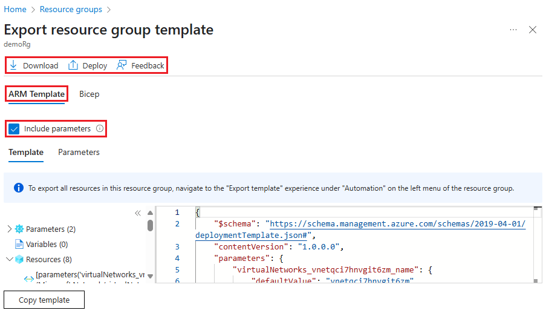

# Exporting ARM Templates

You can export templates by either using the portal, PWSH or AZCLI. Please see below:

## Portal

You can export from the portal via the following 3 options:

- Resource Group
- Resource itself
- Deployments

### Resource group template export.

To export one or more resources from a resource group:

Select the resource group that contains the resources you want to export.

Select one or more resources by selecting the checkboxes. To select all, select the checkbox on the left of Name. The Export template from the top menu only becomes enabled after you've selected at least one resource.

Screenshot of selecting all resources for export in Azure portal.

Select Export template from the top menu. The Export template from the left menu exports all the resources in the group to a template.

Select ARM Template. The exported template is displayed, and is available to download and deploy.



Screenshot of the displayed exported template in Azure portal.

### Resource template export

This is very easy, just go to the resource and select export template.

## Azure CLI

you can also do this via simple AZ CLI commands. Please see below:

### Resource group export

```bash
az group export --name RGGROUPNAME > file.json
```

### resource only export

you can also selective within the group by passing the resource IDs which is used for the resource.

```bash
storageAccountID=$(az resource show --resource-group demoGroup --name demostg --resource-type Microsoft.Storage/storageAccounts --query id --output tsv)
az group export --resource-group demoGroup --resource-ids $storageAccountID
```

### Deployments
```bash
az deployment group export --resource-group demoGroup --name demoDeployment
```

## Powershell

PowerShell can do the same thing. 

### export RG

```powershell
Export-AzResourceGroup -ResourceGroupName demoGroup
```

### export resource only

```powershell
$resource = Get-AzResource -ResourceGroupName <resource-group-name> -ResourceName <resource-name> -ResourceType <resource-type>
Export-AzResourceGroup -ResourceGroupName <resource-group-name> -Resource $resource.ResourceId
```

### Template history

```Powershell
Save-AzResourceGroupDeploymentTemplate -ResourceGroupName demoGroup -DeploymentName demoDeployment
```


you can also use

```Powershell
Save-AzDeploymentTemplate #for deployments to subscriptions
Save-AzManagementGroupDeploymentTemplate #for deployments to management groups
Save-AzTenantDeploymentTemplate #for deployments to tenants
```