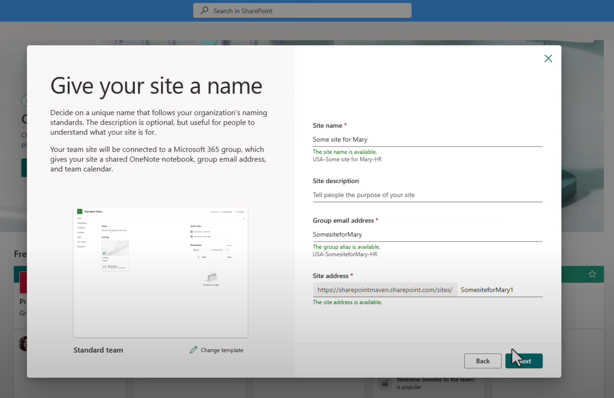

## Entra ID Groups

# What is the difference between an M365 group and a security group?

M365 groups are designed for collaboration and provide access to a suite of Microsoft 365 services, while Security groups are primarily used for controlling access to resources and applications. You can still assign m365 groups Azure RBAC access though.

- M365 groups can contain external users.
- Microsoft 365 Groups can't be members of security groups.
- Can you assign external users to security groups? 
- can you nest sec group into 365 groups?

## Licence Assignment

Licences can be assigned directly to an Entra ID group. If there is an group nested in the group which has the licence assigned that nested group WILL not get the licence. 

# Entra ID Group naming convention

Entra ID provides the ability to have a naming convention for M365 groups. This is broken down into 2 items which are "Attributes" & "Strings". Please note that these groups are groups that are created by users when they create Teams Channels or SharePoint sites. 

