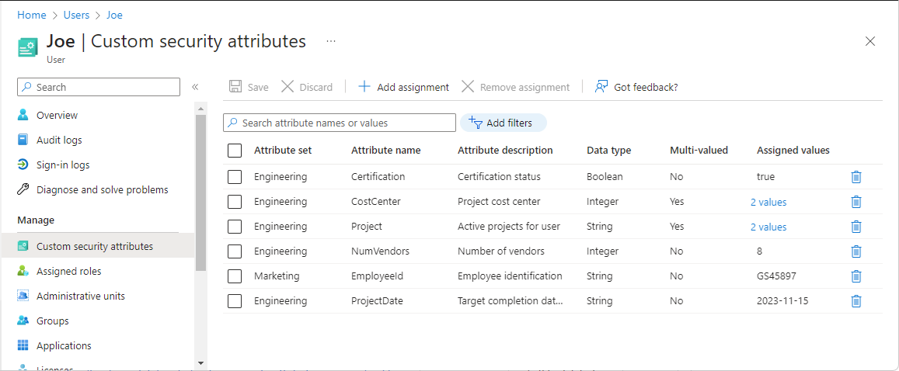

# Entra ID Users

Entra ID users can be added via the portal or via IaC / scripting languages. During & after the setup you can add the necessary Entra ID roles OR add users to admin units or groups.

## Custom security attributes

_Users who want to manage custom security attributes need to have the Attribute Assignment Administrator or Attribute Assignment Reader role. You will need this even if you have global admin_

Custom security attributes is essentially metadata assigned to a user. Depending on what the value = could then result in access they get via ABAC (Attribute based access control).

### Use case (CoPilot generated)

Suppose your organization needs to restrict access to a sensitive application only to employees with a specific security clearance. You can create a custom security attribute called ClearanceLevel and assign values like Confidential, Secret, or TopSecret to users. The application or conditional access policies can then check this attribute to allow or deny access, ensuring only authorized users can use the app.

## Licence assignment

You can assign licences directly to a user. **Ensure that location has been assigned within the user property attributes**. 