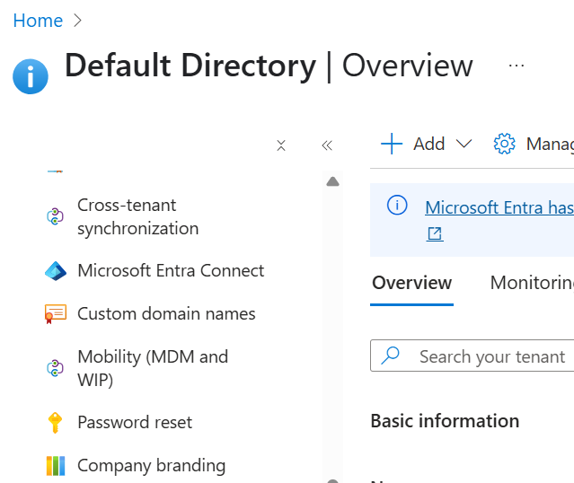

# Self Service Password Reset

# Things to note

- Password writeback require P1 and P2 licence. 
- Licence needs to be assigned to all users. 
- Administrator will require 2 auth methods by default.

## How to guide

- Select Password reset in Entra ID

- Under properties you can choose between groups all you can select all
- Admins will have options to choose which methods to authenticate for the PW reset, you can also select how many auth methods you require (1 or 2). Methods include: 
    - Mobile App Code
    - Email
    - Mobile Phone
    - Security questions

Users will then need to onboard / register themselves to SSPR.

# Notifications
- You can also set the notification settings to alert the users OR / AND alert the admins of the Entra ID tenant.

# On-Premises integration

## Write-Back Passwords

Password writeback allows password changes in the cloud to be written back to an on-premises directory in real time by using either Microsoft Entra Connect or Microsoft Entra Connect cloud sync. 

## Allow users to unlock there accounts with resetting there accounts.

